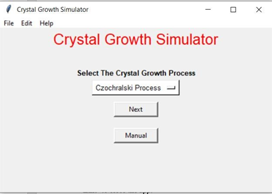
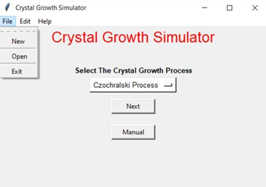
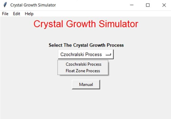
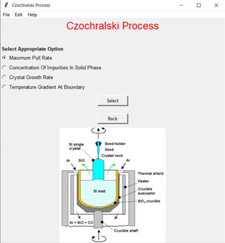
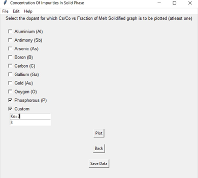
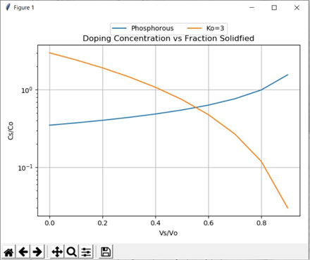
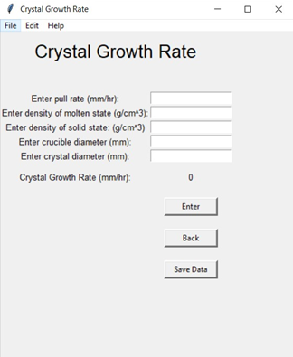
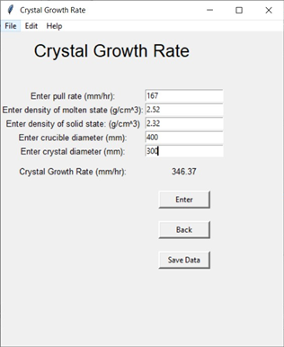
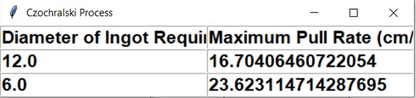

## Description

--> Developed a GUI-based tool that calculates various parameters (crystal growth rate, maximum pull rate, maximum zone length, etc.) related to two silicon ingot growth processes, namely, Czochralski process and Float-zone process.

--> The application was built using IDLE IDE on a Windows system.

--> Tkinter library of Python was used for developing the GUI, numpy library was used for performing certain mathematical calculations and matplotlib library was used for the graphical representation of some results.

--> The crystal_growth_simulator.py file is the main source code file.

--> In this application, apart from the primary feature of simulating crystal growth process, the user is also given a “save” option in the GUI to save the result of a calculation in a file if required. Later the user can also view the previously saved data through the application GUI itself.

--> A converter is also embedded in the application to help the user in performing conversions between different set of units if required.

## UI Snapshots

